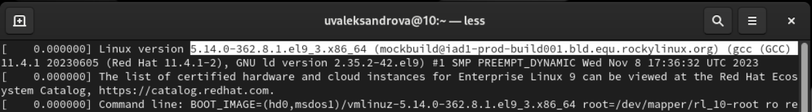
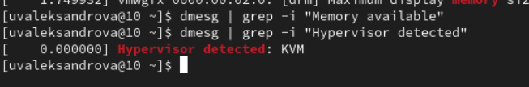

---
## Front matter
lang: ru-RU
title: Лабораторная работа №1
subtitle: Основы Информационной безопасности
author:
  - Александрова У.В.
institute:
  - Российский университет дружбы народов, Москва, Россия
date: 17 февраля 2024

## i18n babel
babel-lang: russian
babel-otherlangs: english

## Formatting pdf
toc: false
toc-title: Содержание
slide_level: 2
aspectratio: 169
section-titles: true
theme: metropolis
header-includes:
 - \metroset{progressbar=frametitle,sectionpage=progressbar,numbering=fraction}
 - '\makeatletter'
 - '\beamer@ignorenonframefalse'
 - '\makeatother'
---

# Информация

## Докладчик

:::::::::::::: {.columns align=center}
::: {.column width="70%"}

  * Александрова Ульяна Вадимовна
  * студентка
  * Российский университет дружбы народов

:::
::: {.column width="30%"}

:::
::::::::::::::

## Цель работы

Целью данной работы является приобретение практических навыков установки операционной системы на виртуальную машину, настройки минимально необходимых для дальнейшей работы сервисов.

# Выполнение лабораторной работы

## Установка ПО

{#fig:001 width=70%}

## Установка ПО

{#fig:002 width=70%}

{#fig:003 width=70%}

## Установка ПО

{#fig:005 width=70%}

## Настройки ПО

{#fig:007 width=70%}

## Итог установки

{#fig:009 width=70%}

# Домашнее задание

## Версия ядра Linux

{#fig:011 width=70%}

## Частота процессора

{#fig:012 width=70%}

## Модель процессора и объем доступной оперативной памяти

{#fig:013 width=70%}

## Тип обнаруженного гипервизора

{#fig:014 width=70%}

## Тип файловой системы корневого раздела

{#fig:015 width=70%}

## Последовательность монтирования файловых систем

{#fig:016 width=70%}

# Вывод

Я приобрела практических навыки установки операционной системы на виртуальную машину, настройки минимально необходимых для дальнейшей работы сервисов.

:::

