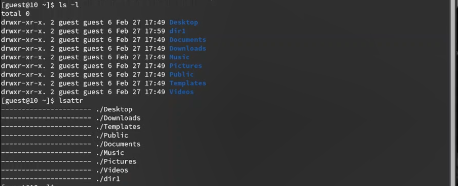

---
## Front matter
lang: ru-RU
title: Лабораторная работа №1
subtitle: Основы Информационной безопасности
author:
  - Александрова У.В.
institute:
  - Российский университет дружбы народов, Москва, Россия
date: 17 февраля 2024

## i18n babel
babel-lang: russian
babel-otherlangs: english

## Formatting pdf
toc: false
toc-title: Содержание
slide_level: 2
aspectratio: 169
section-titles: true
theme: metropolis
header-includes:
 - \metroset{progressbar=frametitle,sectionpage=progressbar,numbering=fraction}
 - '\makeatletter'
 - '\beamer@ignorenonframefalse'
 - '\makeatother'
---

# Информация

## Докладчик

:::::::::::::: {.columns align=center}
::: {.column width="70%"}

  * Александрова Ульяна Вадимовна
  * студентка
  * Российский университет дружбы народов

:::
::: {.column width="30%"}

:::
::::::::::::::

## Цель работы

Получение практических навыков работы в консоли с атрибутами файлов, закрепление теоретических основ дискреционного разграничения доступа в современных системах с открытым кодом на базе ОС Linux.

# Выполнение лабораторной работы

## 1-3.

{#fig:001 width=70%}

## 4.

{#fig:002 width=70%}

## 5.

{#fig:003 width=70%}

## 6.

{#fig:004 width=70%}

## 7. 

{#fig:005 width=70%}

## 8.

{#fig:006 width=70%}

## 9.

{#fig:007 width=70%}

## 10.

{#fig:008 width=70%}

## 11.

{#fig:010 width=70%}

## 12.

{#fig:011 width=70%}

## 13. 

{#fig:012 width=70%}

{#fig:013 width=70%}

## Минимальные права для совершения операций

| | | | | |
|-|-|-|-|-|
|Операция|Минимальные права на директорию|Минимальные права на файл|
|Создание файла|d(300)|-|
|Удаление файла|d(300)|-|
|Чтение файла|d(100)|(400)|
|Запись в файл|d(100)|(200)|
|Переименование файла|d(300)|(000)|
|Создание поддиректории|d(300)|-|
|Удаление поддиректории|d(300)|-|

## Выводы

Я получила практические навыки работы в консоли с атрибутами файлов, закрепила теоретические основы дискреционного разграничения доступа в современных системах с открытым кодом на базе ОС Linux.

